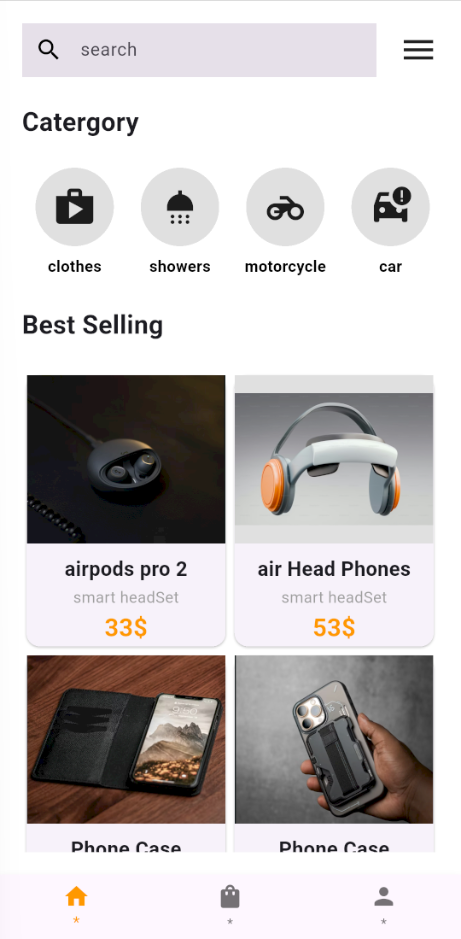
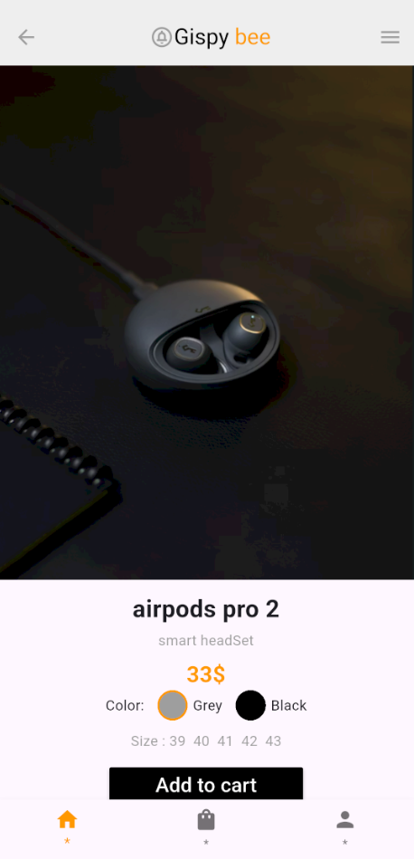

# 🐝 Gispy Bee - Flutter E-commerce UI Kit

A modern, clean, and responsive **E-commerce UI** built with **Flutter**. This project showcases a professional shopping experience with a focus on sleek design and smooth navigation.

---

## ✨ Features
* **Modern UI/UX:** Clean and intuitive design patterns using Flutter widgets.
* **Category Browsing:** Easy navigation through categories like Clothes, Electronics, and more.
* **Best Selling Section:** Grid-based layout for showcasing trending products.
* **Product Details Page:** Comprehensive view with price, color selection, and size options.
* **Custom Navigation:** Interactive bottom navigation bar for a seamless user experience.

## 🛠️ Tech Stack
* **Framework:** [Flutter](https://flutter.dev)
* **Language:** [Dart](https://dart.dev)
* **Design Pattern:** Component-based UI.

## 📸 Screenshots
| Home Screen | Product Details |
|---|---|
|  |  |

## 🚀 How to Run the Project
1. **Clone the repository:**
   ```bash
   git clone [https://github.com/amer-kriany/flutter-ecommerce-ui.git](https://github.com/amer-kriany/flutter-ecommerce-ui.git)
